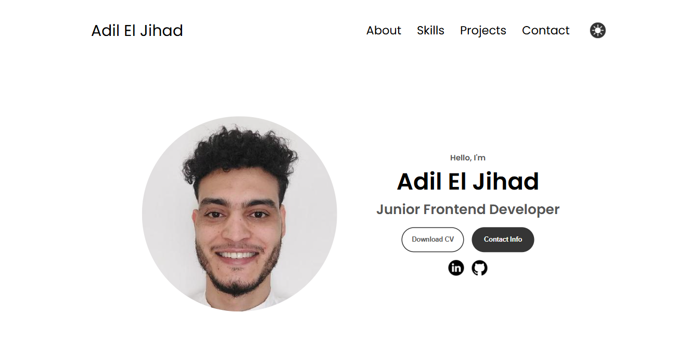
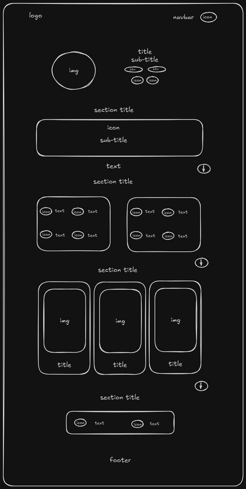

# Design

## Project's design overview

> The project is a personal portfolio website, created with a focus on providing a sleek, modern, and visually appealing user experience. It has been developed using a combination of HTML, CSS, and vanilla JavaScript, ensuring simplicity and usability across multiple devices. The design is responsive, including a desktop navigation menu and a hamburger menu for mobile users, which ensures an optimal browsing experience.

> The color palette has been carefully chosen to provide good contrast, readability, and overall aesthetic appeal. The project features both light and dark mode options, allowing the user to select the most comfortable viewing style. Additionally, transitions are used throughout the site to create smooth, polished interactions.

> The font used is "Poppins," providing a clean and modern look that complements the design's simple and accessible structure. The content is organized into sections, such as Profile, Skills, About, Projects, Contact, and footer, each utilizing clear typography and a structured layout.

- _text color_:

  - White: `#FFFFFF`, `rgb(255, 255, 255)`
  - Black: `#000000`, `rgb(0, 0, 0)`
  - Grey: `#555555`, `rgb(85, 85, 85)`
  - Light Grey: `#AAAAAA`, `rgb(170, 170, 170)`

- _background color_:

  - White: `#FFFFFF`, `rgb(255, 255, 255)`
  - Black: `#212121`, `rgb(33, 33, 33)`
  - Grey: `#F9F9F9`, `rgb(250, 250, 250)`
  - Light Grey: `#B5B5B5`, `rgb(181, 181, 181)`
  - Dark Grey: `#4A4A4A`, `rgb(74, 74, 74)`

- _button and border color_:

  - Button background (light): `#353535`, `rgb(53, 53, 53)`
  - Button background (dark): `#CACA`, `rgb(202, 202, 202)`
  - Button text hover: `#BEBEBE`, `rgb(190, 190, 190)`
  - Border color: `#A3A3A3`, `rgb(163, 163, 163)`
  - Button border: `#353535`, `rgb(53, 53, 53)`
  - Button border hover: `#FFFFFF`, `rgb(255, 255, 255)`

- _container border_:
  - Border container: `#5C5C5C`, `rgb(92, 92, 92)`

---

## Wireframe(s)

> Include your wireframe(s) and link to wireframe

- _Home page_

### Design

